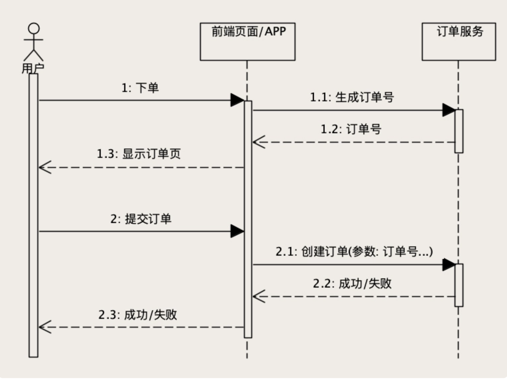
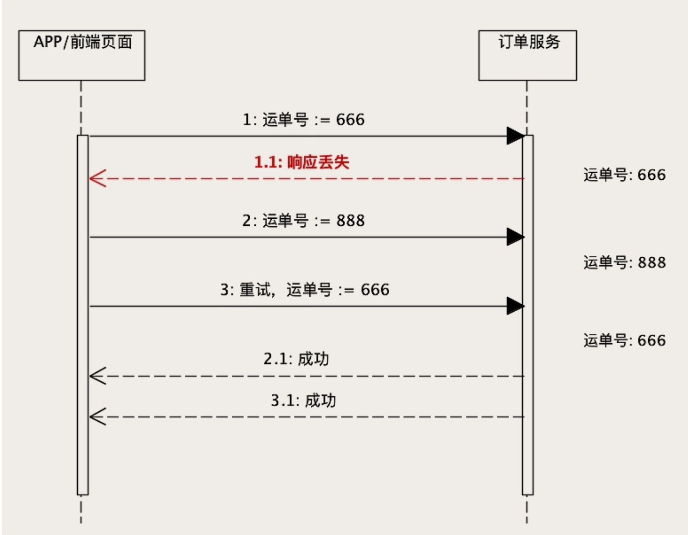

# 01、创建和更新订单时，如何保证数据准确无误？

订单系统是整个电商系统中最重要的一个子系统，订单数据也就是电商企业最重要的数据资产。

## 订单系统的核心功能和数据

一个订单系统必备的功能，它包含但远远不限于：

创建订单；
随着购物流程更新订单状态；
查询订单，包括用订单数据生成各种报表。

为了支撑这些必备功能，在数据库中，我们至少需要有这样几张表：
订单主表：也叫订单表，保存订单的基本信息。
订单商品表：保存订单中的商品信息。
订单支付表：保存订单的支付和退款信息。
订单优惠表：保存订单使用的所有优惠信息。

这几个表之间的关系是这样的：订单主表和后面的几个子表都是一对多的关系，关联的外键就是订单主表的主键，也就是订单号。

绝大部分订单系统它的核心功能和数据结构都是这样的。

## 如何避免重复下单？

**如何让订单服务具备幂等性？**

利用数据库的这种“主键唯一约束”特性，在插入数据的时候带上主键，来解决创建订单服务的幂等性问题。

订单系统增加一个“生成订单号”的服务，这个服务没有参数，返回值就是一个新的、全局唯一的订单号。在用户进入创建订单的页面时，前端页面先调用这个生成订单号服务得到一个订单号，在用户提交订单的时候，在创建订单的请求中带着这个订单号。

对于创建订单服务来说，可以通过预先生成订单号，然后利用数据库中订单号的唯一约束这个特性，避免重复写入订单，实现创建订单服务的幂等性

## 如何解决 ABA 问题？

更新订单服务，可以通过一个版本号机制，每次更新数据前校验版本号，更新数据同时自增版本号，这样的方式，来解决 ABA 问题，确保更新订单服务的幂等性

## 思考

### 1、如何防止重复提交订单？

1. 前端按钮防抖（Debounce）

2. 服务器端幂等性，幂等性Token，订单号重复检查。可以通过Redis设置过期时间，也可以使用数据库定期清理过期Token。

3. 乐观锁（Optimistic Locking）在订单数据表中使用版本号（Version）在更新或创建订单时，检查版本号是否变化

4. 订单号作为主键，利用数据库字段唯一
