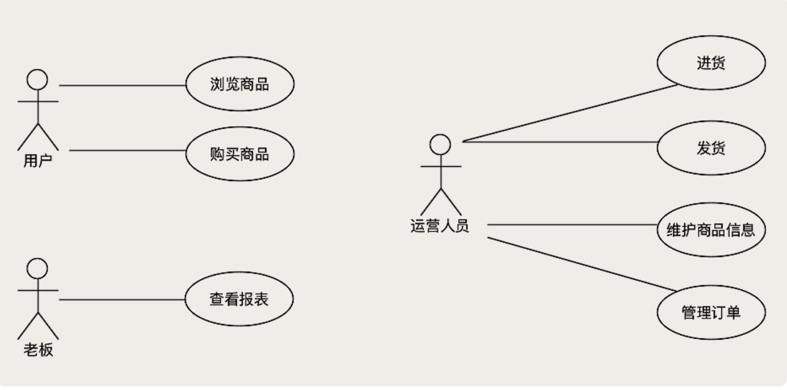
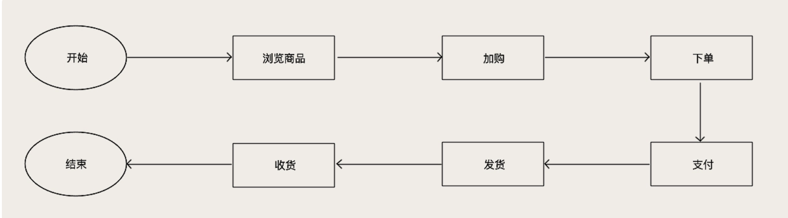
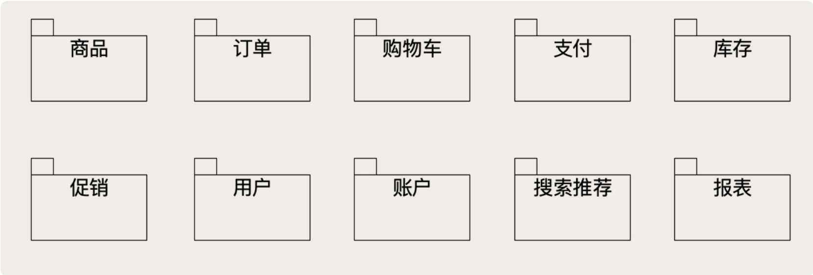

# 电商系统是如何设计的

## 1、电商系统的核心流程是什么样的？

## 2、如何根据流程来划分功能模块

核心功能：**商品、购物车、订单、支付和库存**

商品：维护和展示商品信息和价格。

订单：维护订单信息和订单状态，计算订单金额。

购物车：维护用户购物车中的商品。

支付：负责与系统内外部的支付渠道对接，实现支付功能。

库存：维护商品的库存数量和库存信息。

促销：制定促销规则，计算促销优惠。

用户：维护系统的用户信息，注意用户模块它是一个业务模块，一般不负责用户登录和认证，这是两个完全不同的功能。

账户：负责维护用户的账户余额。

搜索推荐：负责商城中，搜索商品和各种列表页和促销页的组织和展示，简单的说就是决定让用户优先看到哪些商品。

报表：实现统计和分析功能，生成报表，给老板来做经营分析和决策使用。

**促销模块**比较复杂，我们把促销的变化和复杂性封禁在促销模块内部，不能让一个促销模块把整个电商系统都搞得非常复杂。

把促销模块与其他模块的接口设计的相对简单和固定，这样系统的其他模块就不会因为新的促销玩儿法而改变。

在创建订单时，订单模块把商品和价格信息传给促销模块，促销模块返回一个可以使用的促销列表，用户选择好促销和优惠，订单模块把商品、价格、促销优惠这些信息，再次传给促销模块，促销模块则返回促销价格。

最终生成的订单中，只记录订单使用了哪几种促销，以及最终的促销价就可以了。这样，不管促销这个模块的玩儿法怎么变化，订单和其他模块的业务逻辑不需要随之改变。

## 额外

1、A商品100元 B商品100元，如果遇到200-10的促销，那么每个商品均摊5元，可以方便单件售后等

2、一次性购买很多商品，中间夹杂各种优惠，如果需要售后退货等，应该怎么设计？

可以让促销服务提供两个接口 一、提供促销可用接口，返回可以使用的促销，二、提供算价接口，无冲突计算商品的出校后的价格等等。订单服务和购物车就相对单纯，只需要告诉我最后的价格即可

3、下单扣减库存还是发货扣减库存？

一般来说，下单锁定库存，发货减库存
